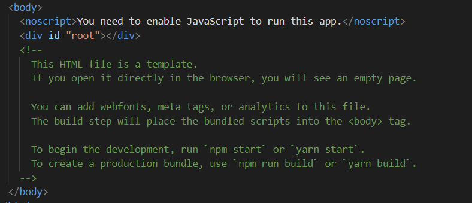

# Käyttöliittymän rakentaminen Node-sovellukselle: React.js

## Orientaatio

Nodella on tässä materiaalissa toteutettu back-end sovelluksia, jotka vastaanottavat selaimelta palvelupyyntöjä ja lomakkeilta lähetettyä dataa, suorittavat pyyntöihin liittyvät toimenpiteet kuten tiedoston käsittely tai tietokantakutsut ja lopuksi palauttavat selaimelle jonkinlaisen vastauksen. 

Sovellusten front-endiin eli selaimen esittämään käyttöliittymäkerrokseen ei ole vielä otettu kantaa, muuten valmiiden tyylikirjastojen hyödyntämisen näkökulmasta \(Bootstrap, Pure.css\). 

Tässä osassa tehdään tiivis katsaus suosittuun React-kirjastoon, jota voidaan hyödyntää käyttöliittymien rakentamisessa web-sovelluksiin.

## Yleistä

Front-end ohjelmoinnissa on tällä hetkellä kaksi suurta frameworkkia \(sovelluskehystä\): [Angular ](https://angularjs.org/)ja [ReactJS](https://facebook.github.io/react/). Lisäksi altavastaajana markkinoille on ilmestynyt kevyempi ja monen mielestä edellisiä helpommin omaksuttava ja pienempikokoinen Vue. 

AngularJS on Googlen vuonna 2010 julkaisema tuote, joka koki uudelleensyntymän vuonna 2016. Tämän jälkeen siitä on käytetty nimeä Angular V2 \(ilman JS-päätettä\). React on puolestaan Facebookin alunperin vuonna 2013 kehittämä framework, joka saavutti nopeasti suuren suosion julkaisunsa jälkeen. 

Angular 2 on käytännössä kokonaan uudelleenkirjoitettu toteutus Googlen tuotteesta, minkä myötä myös ohjelmien logiikka on erilainen. Näinollen vanhat AngularJS-sovelluksetkaan eivät ole enää yhteensopivia Angular 2:n kanssa. Tämä aiheutti ymmärrettävästi kuohuntaa web-kehittäjien keskuudessa ja se lienee myös verottanut frameworkin käyttäjiä. Angularin alkuperäinen versio on edelleen laajasti käytössä.

## Vertailua

Vertailu sovelluskehysten välillä on hieman hankalaa, koska ne on suunniteltu erilaisiksi. Angular on täydellinen MVC-mallin mukainen \(Model-View-Controller\) sovelluskehys, mikä vaatii kehitettävältä sovellukselta tietynlaista rakennetta ja koodaustapaa. Tämä nostaa Angularin osaamiskurvia jonkin verran ja tekee siitä vaikeammin lähestyttävän. 

Sen sijaan React on oikeastaan enemmänkin JavaScript-kirjasto, joka tarjoaa mahdollisuuden käyttöliittymäkomponenttien rakentamiseen JavaScriptillä. React ei tarjoa kaikkea sovellusten vaatimaa toiminnallisuutta itse, eli esim. reittien luomiseen tai tilanhallintaan joudutaan hyödyntämään lisäkirjastoja. 

Reactiin kehitettyjen lisäpalikoiden, kuten [React Nativen](https://reactnative.dev/) avulla, on sillä myös mahdollista tehdä mobiilisovelluksia jotka kääntyvät natiivikoodiksi Androidille ja iOS:lle. Latausmäärien ja työpaikkailmoitusten perusteella React tuntuu olevan tällä hetkellä kaikkein suosituin ja kysytyin teknologia.

Verkosta löytyy erilaisia [vertailuja ](https://www.themexpert.com/blog/angular-vs-react-vs-vue)näiden kolmen ominaisuuksista. 


## Ensimmäinen ohjelma 

Reactin kokeilu on tehty helpoksi. Saat ladattua Reactin kirjastot ja esimerkkisovelluksen yhdellä komennolla käyttöösi. Tämä prosessi on kuvattu hyvin Reactin omassa dokumentaatiossa [täällä](https://reactjs.org/docs/create-a-new-react-app.html#create-react-app). Ideana on käyttää npx-komentoa, joka lataa \(kuten npm\) tarvittavat koodit koneellesi ja suorittaa asennustoimenpiteet. 

Tämän jälkeen voit käynnistää Node-sovelluksen \(npm start\), joka käynnistää web-palvelin ja tarjoilee esimerkkisovelluksen selaimessa osoitteessa http://localhost:3000.

```bash
npx create-react-app my-app
cd my-app
npm start
```

Sovellus aukeaa selaimeen ja näyttää esimerkkisovelluksen tuottaman HTML-sivun \(alla\). Vieressä myös hakemistolistaus React-sovelluksen sisältämistä tiedostoista.


Sovellus asuu hakemistossa **myApp**, joka annettiin create-react-app -komennolle parametrina. Sen sisällä on monenlaista tavaraa, josta keskeisin on kuitenkin sovelluksen JavaScript-koodin sisältämä **src**.

Avataan src-kansiosta index.js -tiedosto ja korvataan koko sen sisältö omalla sovelluksella. 

```jsx
import React from "react";
import ReactDOM from "react-dom";

const App = () => (
  <div>
    <h1>Ensimmäinen React-sovellukseni!</h1>
  </div>
);

ReactDOM.render(<App />, document.getElementById("root"));
```

Tallenna tiedosto tämän jälkeen \(Node-palvelin käynnistyy uudestaan automaattisesti= ja lataa selaimella sivu uudestaan. Muutosten tulisi näkyä selaimessa.  


## Koodin läpikäynti

Ohjelmakoodissa tuodaan ensin import-lauseilla sovelluksen käyttöön Reactin omia kirjastoja. Tämän jälkeen riveillä 4-8 määritellään App-niminen "komponentti" käyttäen ES6:n notaatiota.  Alla olevassa esimerkissä on esitetty miten sama komponentti ja toiminnallisuus voidaan koodata myös perinteisenä nimettynä funktiona tai anonyymina mutta aukikirjoitetuna funktiona.

```jsx
// Komponenetin määrittely funktiona
function App(){
return (   <div>
             <h1>Ensimmäinen React-sovellukseni!</h1>
           </div>
 )
}

// Komponenetin määrittely perinteiseen tapaan anonyymifunktiona
const App = function() {
return (   <div>
             <h1>Ensimmäinen React-sovellukseni!</h1>
           </div>
 )
}

// Komponenetin määrittely ES6:n tapaan anonyymifunktiona

const App = () => (
  <div>
    <h1>Ensimmäinen React-sovellukseni!</h1>
  </div>
);
```

Komponentti luo siis HTML-koodia JavaScriptin avulla hyödyntäen Reactin omaa JSX-notaatiota. Ja siitä koko Reactissa on oikeastaan kysymys. 

Lopuksi rivillä 10 pyydetään Reactia renderöimään eli piirtämään äsken luomamme komponentti "App" HTML-sivulta löytyvään elementtiin, jonka id-tunniste on "root".

```jsx
ReactDOM.render(<App />, document.getElementById("root"));
```

Sivupohja johon sovellus komponentteja sijoittelee löytyy public-hakemistosta ja on nimeltään index.html. Se on käytännössä tyhjä HTML-sivu, johon on lisätty muutamia rakenteellisia elementtejä. 

Sivupohjan &lt;body&gt; -tägin sisältö on näkyvissä ao. kuvassa. Huomaa &lt;div&gt; -elementti ja sen id "root". Tämän lohkon sisälle React siis sijoittaa edellä luodun komponentin.



## **Komponenttien kierrätystä**

Reactissa komponentteja voidaan luoda lisää ja uudelleenkäyttää. Luodaan seuraavaksi toinen komponentti &lt;Hello /&gt; jota kutsutaan aiemmin luodusta &lt;App /&gt; komponentista.

```jsx
import React from "react";
import ReactDOM from "react-dom";

const App = () => (
  <div>
    <h1>Ensimmäinen React-sovellukseni!</h1>
    <Hello />
    <Hello />
    <Hello />
  </div>
);

const Hello = () => (
  <div>
    <p>Hoi Maailma!</p>
  </div>
);

ReactDOM.render(<App />, document.getElementById("root"));
```

Lisäämällä tyylimääreet index.html -tiedostoon \( ennen &lt;body&gt; tägiä \) saadaan sivulle vähän ilmettä.

```jsx
<style>
    div p {
      border: 1px solid blue;
      border-radius: 10px;
      padding: 10px;
    }
  </style>
```


## **Reactin sielunelämää**

Vaikka esimerkkiohjelma käynnistää Reactin Node-sovelluksen pyörittämässä web-palvelimessa, voidaan Reactia hyödyntävä web-sivu tai -sovellus tarjoilla minkä tahansa web-palvelimen kautta; sehän koostuu tutuista HTML/CSS/JavaScript-tiedostoista, joita selain osaa sellaisenaan suorittaa. 

Mainittakoon myös, että React-sovelluksen "paketointi" vaatii kohtalaisen määrän työkaluja, joiden läpi kirjoitettu sovelus ajetaan \(edellä ajetussa esimerkkiohjelmassa työkalut ovat valmiiksi konfiguroitu\) Näitä ovat mm. [Babel](https://babeljs.io/) \(joka kääntää JavaScriptin uusimman version ES6:n mukaan kirjoitetun koodin selainten tukemaan JS:n muotoon\) sekä [Webpack](https://webpack.js.org/) \(joka paketoi lukuisat JavaScript-moduulit yhdeksi fyysiseksi tiedostoksi selainten ymmärtämään muotoon\) . Näitä ei tässä materiaalissa kuitenkaan sen enempää käsitellä.

## Tiedonvälitys komponenteille \(props\)

Komponentti joka tulostaa tervehdyksen on kätevä, mutta se olisi vielä monikäyttöisempi jos tervehdystä voisi tarpeen vaatiessa muuttaa. Tähän käytetään propseja, jotka toimivat ohjelmointikielissä tuttujen parametrien tavoin. Tehdään komponentti, joka saa kutsuvaiheessa parametreja 

Komponentin määrittelyssä JSX funktio saa parametrina props-olion. Komponentin luoma HTML-koodi puolestaan sijoittelee props-olion sisältämiä kenttiä \(color, greeting, author\) sopiviin paikkoihin.

Huomaa myös className-attribuutti, jota Reactin JSX käyttää class-tyylimääreen asettamiseen HTML:stä tutun class:in sijaan.

```jsx
const CustomHello = (props) => {
  return (
    <div>
      <p className={props.color}>
        {props.greeting} (<strong> {props.author} </strong> )
      </p>
    </div>
  );
};
```

Komponentin käyttö tapahtuisi alla kuvatulla  tavalla. Huomaa miten komponentin kutsussa määritellään attrribuutit, jotka välittävät tietoa komponenttiin. 

```jsx
import React from "react";
import ReactDOM from "react-dom";

const App = () => (
  <div>
    <h1>Ensimmäinen React-sovellukseni!</h1>
    <Hello />
    <Hello />
    <CustomHello author="Mika" greeting="Tervepä terve." />
    <CustomHello
      author="Matti"
      greeting="Se on morjens!"
      color="green"
    />
  </div>
);

ReactDOM.render(<App />, document.getElementById("root"));
```

Lopuksi lisätään vielä CSS-tyylimääritys index.html -tiedostoon, jotta viimeisen &lt;CustomHello&gt; kutsun ja siinä olevan color-määrityksn tuottama HTML-tyyli voidaan esittää selaimessa.

```jsx
<style>
    div p {
      border: 1px solid blue;
      border-radius: 10px;
      padding: 10px;
    }
    .green {
      color: green;
    }
  </style>
```

Ohjelman suoritus näyttää seuraavalta:


## JSON-datan käsittely

Usein sovellus saa dataa valmiina pakettina JSON-muodossa, jolloin se pitää parsia ja esittää loppukäyttäjälle jossain järkevässä muodossa. Tehdään seuraavaksi komponentti joka käy läpi saamansa JSON taulukon ja esittää sen ruudulla. Data sisältää tietoja kuuluisista sitaateista. 

Datasetti voidaan esitellä tässä vaiheessa osana JavaScript-koodia. Todellisissa sovelluksisa se yleensä kuitenkin saadaan AJAX-kutsun vastauksena esim. REST API:n kautta. 

```jsx
const quotes = [
  {
    quote: "Life isn’t about getting and having, it’s about giving and being.",
    author: "Kevin Kruse",
  },
  {
    quote: "Whatever the mind of man can conceive and believe, it can achieve.",
    author: "Napoleon Hill",
  },
  {
    quote: "Strive not to be a success, but rather to be of value.",
    author: "Albert Einstein",
  },
  {
    quote:
      "Two roads diverged in a wood, and I—I took the one less traveled by, And that has made all the difference.",
    author: "Robert Frost",
  },
  {
    quote: "I attribute my success to this: I never gave or took any excuse.",
    author: "Florence Nightingale",
  },
];
```

Määritellään seuraavaksi komponentti, joka saa parametrit propseina. Tämän jälkeen esitellään &lt;div&gt; lohko, jonka sisälle rakennetaan HTML-lista. Listan sisään poimitaan JSON datasta quote- ja author -kentät. Koodissa käytetään JavaScriptin map\(\)-funktiota taulukon läpikäyntiin, sillä JSX:n kanssa for-silmukat aiheuttavat haasteita. Tähän liittyen voit lukea lisää [täältä](https://blog.cloudboost.io/for-loops-in-react-render-no-you-didnt-6c9f4aa73778).

```jsx
const QuoteArray = (props) => {
  const { data } = props;

  return (
    <div>
      <ul>
        {data.map((item) => (
          <li>
            {item.quote} ( {item.author} )
          </li>
        ))}
      </ul>
    </div>
  );
};
```

Tämän jälkeen komponentteja kutsutaan sopivissa kohdin:

```jsx
const App = () => (
  <div>
    <h1>Ensimmäinen React-sovellukseni!</h1>
    <Hello />
    <Hello />
    <CustomHello author="Mika" greeting="Tervepä terve." />
    <CustomHello author="Matti" greeting="Se on morjens!" color="green" />
    <QuoteArray data={quotes} />
  </div>
);

ReactDOM.render(<App />, document.getElementById("root"));
```

Lopputulos näyttää seuraavalta:


Mainittakoon myös toinen vaihtoehto. Yleensä yhden sivun sovellukset \(SPA=Single Page Application\) Reactissa on tapana rakentaa siten, että sivulla on vain yksi &lt;div&gt; lohko, jonka sisältö rakennetaan &lt;App /&gt; komponentissa lukuisista pienemmistä komponenteista .

Periaatteessa sovelluksessa voidaan kutsua ReactDOM.render\(\) -metodia myös useampaan kertaan. Myös tämä mahdollistaa komponenttien sijoittelun eri kohtiin sivulla. Alla olevassa esimerkissä ensimmäinen render-funktio sijoittaa &lt;App /&gt; komponentin root-nimiseen elementtiin. Toinen puolestaan sijoittaa &lt;QuoteArray /&gt; komponentin quotes-nimiseen elementtiin.

```jsx
ReactDOM.render(<App />, document.getElementById("root"));
ReactDOM.render(<QuoteArray data={quotes} />,
  document.getElementById("quotes")
);
```

Tällaisen koodin käyttö vaatii sen, että lisäämme HTML-sivupohjaan tarvittavat rakenteet, tässä tapauksessa quotes-nimisen DIV-lohkon.

```jsx
<body>
    <noscript>You need to enable JavaScript to run this app.</noscript>
    <div id="root"></div>
    <div id="quotes"></div>
  </body>
```

## AJAX-kutsun tekeminen

Jatkokehitetään ohjelmaa siten, että se hakee esittämänsä datan AJAXin avulla. Tähän voidaan käyttää peruskurssiltakin tuttua natiivi-Javascriptiä mutta helpoteaan elämää hieman Fetch API:n avulla. Se on uusien selaimien tukema tapa tehdä AJAX-kutsu hieman hallitummin.

Määritellään kompoentti GetData, joka suorittaa AJAX-kutsun haluttuun osoitteeseen. Esimerkissä olen vienyt edellisen esimerkin sitaattidatan jsonbin.io -nimiseen verkkopalveluun, josta JSON-dataa voi näppärästi hakea. 

Fetch hakee datan ja palauttaa ensimmäisessä then\(\) -lohkossa saamansa vastauksen. Tämän jälkeen then\(\) -lohkoja voidaan ketjuttaa peräkkäisten operaatioiden aikaansaamiseksi. Toisessa then\(\) -lohkossa JSON-muotoinen data otetaan items-muuttujaan talteen ja välitetään &lt;QuoteArray&gt; -komponenttiin props-parametrina. Samalla pyydetään ReactDOM-render\(\) -metodia piirtämään kyseinen komponentti "quotes"-nimiseen lohkoon sivulla.

Lopuksi kutsutaan &lt;GetData /&gt; komponenttia ja sijoiteaan se root-lohkoon sivulla. Lopputulos on sama kuin aiemmin, sillä erotuksella että tiedot haetaan nyt AJAXin avulla.

```jsx
const GetData = () => {
  fetch("https://api.jsonbin.io/b/5e9ef7272940c704e1dc1099")
    .then((results) => {
      return results.json();
    })
    .then((data) => {
      console.log(data);
      const items = data.quotes;
      ReactDOM.render(
        <QuoteArray data={items} />,
        document.getElementById("quotes")
      );
    });
  return <div>Nothing here. Fething data...</div>;
};

ReactDOM.render(<GetData />, document.getElementById("root"));
```

Toinen vaihtoehto olisi tarjoilla dataa paikallisen REST API:n kautta tai esim. näppärän JSON-server-moduulin avulla. Kyseisen moduulin saa tarjoilemaan lokaalisti tiedostossa sitaatit.json olevaa dataa yksinkertaisella komennolla:

```jsx
npx json-server --port=5000 --sitaatit.json
```

## Lomakkeiden käsittely

Lomakkeiden käsittely Reactilla on melko haastavaa.  Reactin dokumentaatiossa lomakkeet laaditaan luokkapohjaisina komponentteina, joihin voidaan sijoittaa kuuntelijoita ja joissa kenttien arvot tallennetaan luokkien sisältämiin kenttiin tiloina \(state\). Hiljattain julkaistu Reactin uusi versio näyttää hiljalleen luopuvan luokkaan määritellyistä komponenteista ja tilanhallinta on toteutettu hieman uudella tavalla.

Seuraavassa esimerkissä rakennetaan hakupalkkina toimiva lomake tutulla komponenttimallilla ilman luokkia. Kenttien lukemisessa käytetään natiivi-JavaScriptiä. Lomakkeen tyylittelyssä on käytetty Bootstrapia, mikä johdosta index.html -tiedoston &lt;head&gt; lohkoon on lisätty viittaus Bootstrapin CSS-tiedostoon.

```jsx
    <link
      rel="stylesheet"
      href="https://stackpath.bootstrapcdn.com/bootstrap/4.4.1/css/bootstrap.min.css"
      integrity="sha384-Vkoo8x4CGsO3+Hhxv8T/Q5PaXtkKtu6ug5TOeNV6gBiFeWPGFN9MuhOf23Q9Ifjh"
      crossorigin="anonymous"
    />
```

Itse lomakkeen määrittely HTML-koodilla on seuraavanlainen. Myöhemin koodi sijoitetaan osaksi React-komponenttia.

```jsx
        <form>
          <div className="form-group">
            <label>Hae: </label>
            <input
              type="query"
              className="form-control"
              id="query"
              placeholder="Syötä hakutermi"
              name="query"
            />
          </div>
          <div className="form-group">
            <button type="submit" id="button1" className="btn btn-primary">
              Submit
            </button>

            <button
              type="button"
              className="btn"
              >
              Hae kaikki
            </button>
          </div>
        </form>
```

Lomake näyttää selaimessa seuraavalta:


Määritellään index.js tiedostoon komponentti nimeltä SearchBar. Huomaa erityisesti että komponenttiin on määritelty "alikomponentteja" \(handleSubmit ja handleClick\) jotka käsittelevät lomakkeelta tulevat onClick ja onSubmit -tapahtumat. Ne ovat siis funktioita komponenttien sisällä. 

Lomakkeen kenttiin voidaan liittää tapahtuman kuuntelijoita saman tapaan kuin HTML:ssä. Notaatio ainoastaan on hieman erilainen. 

```jsx
const SearchBar = () => {

// Määritellään käsittelija napille 1 
  const handleSubmit = (event) => {
    event.preventDefault();
    console.log("Tapahtuman aiheutti: ", event.target);
    var form = event.target;
    console.log("Hakusana: ", form.query.value);
  };
  
  // Määritellään käsittelija napille 2 
  const handleClick = (event) => {
    event.preventDefault();
    console.log("Tapahtuman aiheutti: ", event.target);
  };
  // Komponentin palauttama JSX muotoinen esitys
  return (
    <div>
      <h1>Hakusivu</h1>
      <div>
        <form onSubmit={handleSubmit}>
          <div className="form-group">
            <label>Hae: </label>
            <input
              type="query"
              className="form-control"
              id="query"
              placeholder="Syötä hakutermi"
              name="query"
            />
          </div>
          <div className="form-group">
            <button type="submit" id="button1" className="btn btn-primary">
              Submit
            </button>

            <button
              type="button"
              className="btn"
              onClick={ handleClick }
              >
              Hae kaikki
            </button>
          </div>
        </form>
      </div>
    </div>
  );
};
ReactDOM.render(<SearchBar />, document.getElementById("root"));
```

Suoritettuna ohjelma näyttää seuraavalta. 


Kun nappeja painetaan tulostaa konsoliin ao. kuvan mukaiset tekstit. Nämä ovat siis tapahtumankäsittelijöiden suorittamat rivit. Ensimmäinen nappi tulostaa tiedot tapahtuman onSubmit aiheuttajasta \(form\). Sen avulla päästään myös kiinni kenttään kirjoitettuun hakusanaan, joka tulostetaan query-kentästä myös konsoliin.

Toisen napin pinaminen tulostaa konsoliin sen tapahtuman aiheuttajan, eli viitteen Button-elementtiin.


